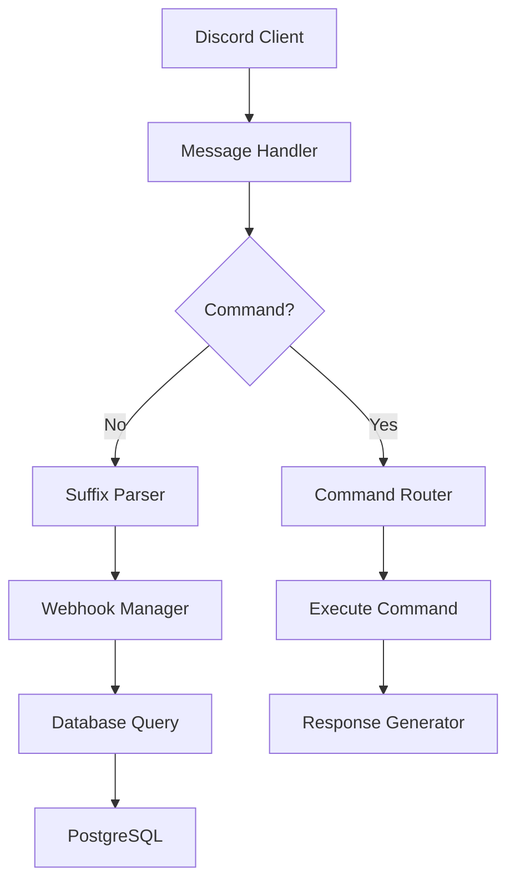

# BetaPoisoner Discord Bot 🤖

[](https://nodejs.org/)
[](https://www.typescriptlang.org/)
[](https://www.postgresql.org/)
[](https://discord.js.org/)

A feature-rich Discord bot with puppet system integration, enabling users to create and manage alternate personas through intuitive chat commands. Built with modern TypeScript architecture and PostgreSQL persistence.

*Add actual screenshot/video here*

## Table of Contents 📚
- [Features](#features-)
- [Installation](#installation-)
- [Configuration](#configuration-⚙️)
- [Database Setup](#database-setup-🗄️)
- [Usage](#usage-📖)
- [Architecture](#architecture-🏗️)
- [Contributing](#contributing-🤝)
- [Support](#support-🔧)

## Features ✨

### Core Functionality
- 🧙 **Dynamic Puppet System**: Create/manage multiple personas with unique identifiers
- 💬 **Contextual Messaging**: 
  - `puppet: Message` for standard communication
  - `puppet:: Action` for roleplay-style emotes
- 🔄 **Webhook Integration**: Automatic message proxying with avatar support

### Technical Features
- 🛡️ **Type-Safe Core**: Full TypeScript implementation with strict type checking
- 📊 **PostgreSQL Backend**: Relational data model for persistent storage
- 📈 **Advanced Logging**: 
  - Daily rotating files (30 day retention)
  - Colorized console output
  - JSON format for log analysis
- 🔒 **Security**: 
  - Environment validation with envalid
  - Sensitive data isolation
- ⚡ **Efficient Commands**: 
  - Modular command architecture
  - Automatic help generation

## Installation 🚀

### Prerequisites
- [Node.js 18.x+](https://nodejs.org/en/download/)
- [PostgreSQL 15+](https://www.postgresql.org/download/)
- [PNPM 8.x+](https://pnpm.io/installation)
- [Discord Developer Application](https://discord.com/developers/applications)

```bash
# Clone repository
git clone https://github.com/betapoisoner/beta-bot.git
cd beta-bot

# Install dependencies
pnpm install

# Configure environment
cp .env.example .env
# Edit .env with your credentials
```

## Configuration ⚙️
### Discord Setup
1. Create application at [Discord Developer Portal](https://discord.com/developers/applications)

2. Navigate to "Bot" section → "Reset Token"

3. Copy token into .env:

```ini
DISCORD_TOKEN=your_bot_token_here
APPLICATION_ID=your_application_id_here
```

### Database Configuration
```ini

DB_USER=postgres
DB_HOST=localhost
DB_NAME=puppetdb
DB_PASSWORD=your_secure_password
DB_PORT=5432
LOG_LEVEL=info # debug | info | warn | error
```
### Final .env file:

```ini
#DISCORD INFO
DISCORD_TOKEN=your_bot_token
APPLICATION_ID=your_app_id

#DATABASE INFO
DB_USER=postgres
DB_HOST=localhost
DB_NAME=puppetdb
DB_PASSWORD=postgres
DB_PORT=5432

#LOG LEVEL FOR WINSTON
LOG_LEVEL=debug
```

## Database Setup 🗄️
### 1. Connect to PostgreSQL:

```bash
psql -U postgres
```

### 2. Create database and table:

```sql
CREATE DATABASE puppetdb;
\c puppetdb

CREATE TABLE puppets (
    id SERIAL PRIMARY KEY,
    user_id VARCHAR(255) NOT NULL,
    name VARCHAR(50) NOT NULL,
    suffix VARCHAR(20) UNIQUE NOT NULL,
    avatar TEXT,
    description TEXT
);
```

## Usage 📖
### Development
```bash
# Development mode (watch + reload)
pnpm dev

# Production build
pnpm build
pnpm start

# Register commands (if needed)
pnpm register
```

### Key Commands 🔑

| Command                             | Description       | Example                                |
| ----------------------------------- | ----------------- | -------------------------------------- |
| `!addpuppet <name> <suffix> [desc]` | Create new puppet | `!addpuppet Merlin mrln A wise wizard` |
| `!mypuppets`                        | List your puppets | `!mypuppets`                           |
| `[suffix]: Message`                 | Speak as puppet   | `mrln: Greetings travelers!`           |
| `[suffix]:: Action`                 | Emote as puppet   | `mrln:: waves his staff`               |
| `!help`                             | Show help menu    | `!help`                                |
| `!roll [max]`                       | Random number     | `!roll 20`                             |

## Architecture 🏗️


## Logging 📝

### Configured with Winston:

- Console output with colors and metadata
- Daily rotating files (30 day retention)
- JSON format for log analysis

```
logs/
├── bot-01-05-2024.log
├── bot-02-05-2024.log
└── bot-03-05-2024.log.gz
```

## Contributing 🤝
### Workflow
1. #### Fork the repository

2. #### Create feature branch: feat/feature-name

3. #### Follow code style guidelines:

    - #### TypeScript strict mode

    - ##### JSDoc comments for public methods

    - #### Winston logging standards

4. #### Commit changes: pnpm commit (uses commitizen)

5. #### Push to your branch

6. #### Open Pull Request

### Testing Requirements 
- Include Jest tests for new features

- Maintain 80%+ test coverage

- Update documentation accordingly

## Support 🔧
- ### Found an issue? [Open a ticket](https://github.com/betapoisoner/beta-bot/issues)

### Made with ❤️ by 𝕭𝖊𝖙𝖆 | [Contribution Guidelines](CONTRIBUTING.md) | [Code of Conduct](CODE_OF_CONDUCT.md)