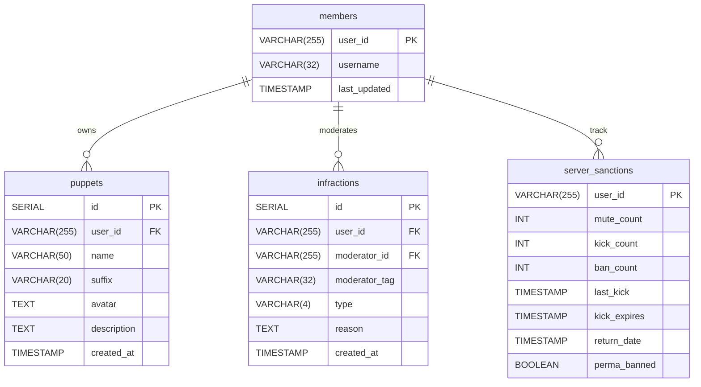
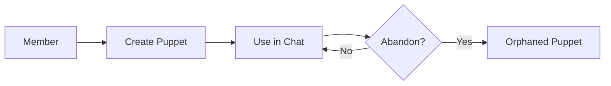

# BetaPoisoner Discord Bot 🤖

[](https://nodejs.org/)
[](https://www.typescriptlang.org/)
[](https://www.postgresql.org/)
[](https://discord.js.org/)

A feature-rich Discord bot with puppet system integration **and advanced moderation capabilities**, enabling users to
create/manage personas and moderators to enforce server rules through automated sanctions.

## Table of Contents 📚

- [Features](#features)
  - [Core Functionality](#core-functionality)
  - [Technical Features](#technical-features)
- [Installation](#installation)
  - [Prerequisites](#prerequisites)
- [Configuration](#configuration)
  - [Discord Setup](#discord-setup)
  - [Database Configuration](#database-configuration)
  - [Final .env file](#final-env-file)
- [Database Setup](#database-setup)
  - [1. Connect to PostgreSQL](#1-connect-to-postgresql)
  - [2. Create database and tables](#2-create-database-and-tables)
- [Usage](#usage)
  - [Development](#development)
  - [Key Commands](#key-commands)
  - [Moderation System](#moderation-system)
    - [Punishment Thresholds](#punishment-thresholds)
- [Architecture](#architecture)
- [Logging](#logging)
- [Contributing](#contributing)
  - [Workflow](#workflow)
  - [Testing Requirements](#testing-requirements)
- [Support](#support-🔧)

## Features

### Core Functionality

- 🧙 **Dynamic Puppet System**: Create/manage multiple personas with unique identifiers
- 💬 **Contextual Messaging**:
  - `puppet: Message` for standard communication
  - `puppet:: Action` for roleplay-style emotes
- ⚖️ **Moderation System**:
  - Progressive warnings system
  - Automatic punishments (mute/kick/ban)
  - Infraction tracking with !infractions command

### Technical Features

- 🚨 **Automated Sanctions**:
  - 3 warns in 24h = 7-day temp ban
  - 5+ warns = automatic mutes
  - 10+ warns = permanent ban
- 🛡️ **Type-Safe Core**: Full TypeScript implementation with strict type checking
- 📊 **PostgreSQL Backend**: Relational data model for persistent storage
- 📈 **Advanced Logging**:
  - Daily rotating files (30 day retention)
  - Colorized console output
  - JSON format for log analysis
- 🔒 **Security**:
  - Environment validation with envalid
  - Sensitive data isolation
- ⚡ **Efficient Commands**:
  - Modular command architecture
  - Automatic help generation
- 🔄 **Webhook Integration**: Automatic message proxying with avatar support

## Installation

### Prerequisites

- [Node.js 18.x+](https://nodejs.org/en/download/)
- [PostgreSQL 15+](https://www.postgresql.org/download/)
- [PNPM 8.x+](https://pnpm.io/installation)
- [Discord Developer Application](https://discord.com/developers/applications)

```bash
# Clone repository
git clone https://github.com/betapoisoner/beta-bot.git
cd beta-bot

# Install dependencies
pnpm install

# Configure environment
cp config/.env.example .env
# Edit .env with your credentials
```

## Configuration

### Discord Setup

1. Create application at [Discord Developer Portal](https://discord.com/developers/applications)

2. Navigate to "Bot" section → "Reset Token"

3. Copy token into .env:

```ini
DISCORD_TOKEN=your_bot_token_here
APPLICATION_ID=your_application_id_here
```

### Database Configuration

```ini
DB_USER=postgres
DB_HOST=localhost
DB_NAME=puppetdb
DB_PASSWORD=your_secure_password
DB_PORT=5432
LOG_LEVEL=info # debug | info | warn | error
```

### Final .env file:

```ini
#DISCORD INFO
DISCORD_TOKEN=your_bot_token
APPLICATION_ID=your_app_id

#DATABASE INFO
DB_USER=postgres
DB_HOST=localhost
DB_NAME=puppetdb
DB_PASSWORD=postgres
DB_PORT=5432

#LOG LEVEL FOR WINSTON
LOG_LEVEL=debug
```

## Database Setup

### 1. Connect to PostgreSQL:

```bash
psql -U postgres
```

### 2. Create database and tables:

```sql
CREATE DATABASE puppetdb;
\c puppetdb

-- Main Puppet System Table
CREATE TABLE puppets (
    id SERIAL PRIMARY KEY,
    user_id VARCHAR(255) NOT NULL,
    name VARCHAR(50) NOT NULL,
    suffix VARCHAR(20) UNIQUE NOT NULL,
    avatar TEXT,
    description TEXT,
    created_at TIMESTAMP DEFAULT CURRENT_TIMESTAMP
);

-- Infraction Tracking System
CREATE TABLE infractions (
    id SERIAL PRIMARY KEY,
    user_id VARCHAR(255) NOT NULL,
    moderator_id VARCHAR(255) NOT NULL,
    moderator_tag VARCHAR(32) NOT NULL,
    type VARCHAR(4) NOT NULL CHECK (type IN ('WARN', 'KICK', 'BAN', 'MUTE')),
    reason TEXT,
    created_at TIMESTAMP DEFAULT CURRENT_TIMESTAMP
);

-- Sanction State Management
CREATE TABLE server_sanctions (
    user_id VARCHAR(255) PRIMARY KEY,
    mute_count INT DEFAULT 0,
    kick_count INT DEFAULT 0,
    ban_count INT DEFAULT 0,
    last_kick TIMESTAMP,
    kick_expires TIMESTAMP,
    return_date TIMESTAMP,
    perma_banned BOOLEAN DEFAULT false
);

-- Member Username Cache
CREATE TABLE members (
    user_id VARCHAR(255) PRIMARY KEY,
    username VARCHAR(32) NOT NULL,
    last_updated TIMESTAMP DEFAULT CURRENT_TIMESTAMP
);

-- Enforce unique suffixes per user
CREATE UNIQUE INDEX idx_puppet_suffix 
ON puppets(user_id, suffix);

-- Prevent duplicate puppet names
CREATE UNIQUE INDEX idx_puppet_names 
ON puppets(user_id, name);

-- Relations
ALTER TABLE public.puppets ADD CONSTRAINT puppets_members_fk FOREIGN KEY (user_id) REFERENCES public.members(user_id);
ALTER TABLE public.server_sanctions ADD CONSTRAINT server_sanctions_members_fk FOREIGN KEY (user_id) REFERENCES public.members(user_id);
ALTER TABLE public.infractions ADD CONSTRAINT infractions_members_fk FOREIGN KEY (user_id) REFERENCES public.members(user_id);


-- For frequent infraction lookups
CREATE INDEX idx_infractions_user ON infractions(user_id);
CREATE INDEX idx_infractions_type ON infractions(type);

-- For expiration checks
CREATE INDEX idx_sanctions_expiry ON server_sanctions(kick_expires);

-- For username history
CREATE INDEX idx_members_username ON members(username);
```

#### Entity Relationship Diagram



#### Key Features

- Temporal Data Tracking: Precise timestamping for all moderation actions
- Moderator Accountability: Permanent record of enforcing staff members
- State Persistence: Maintains punishment status through bot restarts
- Username Versioning: Historical record of member name changes
- Expiration System: Automatic cleanup of temporary punishments

#### Maintenance Tips

```bash
# Daily sanity check
psql -U postgres -d puppetdb -c "VACUUM ANALYZE;"

# Backup command (run nightly)
pg_dump -U postgres -Fc puppetdb > puppetdb_$(date +%Y-%m-%d).dump

# Restore from backup
pg_restore -U postgres -d puppetdb puppetdb_YYYY-MM-DD.dump
```

## Usage

### Scripts

| Command             | Description                             |
| ------------------- | --------------------------------------- |
| `pnpm dev`          | Development mode with hot reload        |
| `pnpm dev:debug`    | Debug with Node inspector               |
| `pnpm build`        | Compile TypeScript to JS                |
| `pnpm start`        | Run production build                    |
| `pnpm register`     | Register slash commands                 |
| `pnpm unregister`   | Remove all commands                     |
| **Code Quality**    |                                         |
| `pnpm format`       | Format code with Prettier               |
| `pnpm format:check` | Check formatting without changes        |
| `pnpm lint`         | Run ESLint checks                       |
| `pnpm lint:fix`     | Auto-fix ESLint issues                  |
| `pnpm typecheck`    | TypeScript validation only              |
| **Database**        |                                         |
| `pnpm migrate`      | Run database migrations (if configured) |
| **Maintenance**     |                                         |
| `pnpm clean`        | Remove build artifacts                  |
| `pnpm reinstall`    | Full clean + dependency reinstall       |

### Development Workflow

```bash
# Typical development session
pnpm format:check && pnpm lint && pnpm dev

# Commit process
pnpm lint:fix && pnpm format
git add .
pnpm commit  # Using commitizen

# CI/CD pipeline example
pnpm install
pnpm format:check
pnpm lint
pnpm build
pnpm test  # If you add tests
pnpm start
```

### Prebuild Hook

```json
// From package.json
"prebuild": "pnpm format:check && pnpm lint"
```

### Key Commands

| Command                             | Description             | Example                                |
| ----------------------------------- | ----------------------- | -------------------------------------- |
| `!addpuppet <name> <suffix> [desc]` | Create new puppet       | `!addpuppet Merlin mrln A wise wizard` |
| `!mypuppets`                        | List your puppets       | `!mypuppets`                           |
| `[suffix]: Message`                 | Speak as puppet         | `mrln: Greetings travelers!`           |
| `[suffix]:: Action`                 | Emote as puppet         | `mrln:: waves his staff`               |
| `!help`                             | Show help menu          | `!help`                                |
| `!roll [max]`                       | Random number           | `!roll 20`                             |
| `!warn @user [reason]`              | Issue warning           | `!warn @spammer Stop flooding`         |
| `!kick @user [reason]`              | Remove user from server | `!kick @harasser No NSFW`              |
| `!ban @user [reason]`               | Permanent ban           | `!ban @scammer Phishing links`         |
| `!infractions [@user]`              | View punishment history | `!infractions @troublemaker`           |

#### Punishment Thresholds

| Warns | Time Frame       | Action        | Duration   |
| ----- | ---------------- | ------------- | ---------- |
| 3     | Any              | Mute          | 10 minutes |
| 5     | Any              | Mute          | 30 minutes |
| 3     | 24 hours         | Kick          | 7 days     |
| 4     | Post-kick return | Permanent Ban | ∞          |
| 7     | Any              | Kick          | 7 days     |
| 10    | Any              | Permanent Ban | ∞          |
| 11    | Post-ban return  | IP Ban\*      | ∞          |

## Architecture


### Moderation System


### Puppet Lifecycle



### Data Flow

```mermaid
flowchart
    Member->>+Puppet: Create with !addpuppet
    Puppet->>-Database: Store metadata
    Member->>+Chat: Use puppet: syntax
    Chat->>Database: Verify suffix
    Database->>-Webhook: Proxy message
```

## Logging

### Configured with Winston:

- Console output with colors and metadata
- Daily rotating files (30 day retention)
- JSON format for log analysis

```
logs/
├──exceptions
|  ├──bot-01-05-2024.json
|  ├── bot-02-05-2024.json
|  └── bot-03-05-2024.json.gz
├── bot-01-05-2024.log
├── bot-02-05-2024.log
└── bot-03-05-2024.log.gz
```

## Contributing

### Workflow

1. #### Fork the repository

2. #### Create feature branch: feat/feature-name

3. #### Follow code style guidelines:

   - #### TypeScript strict mode

   - ##### JSDoc comments for public methods

   - #### Winston logging standards

4. #### Commit changes: pnpm commit (uses commitizen)

5. #### Push to your branch

6. #### Open Pull Request

### Testing Requirements

- Include Jest tests for new features

- Maintain 80%+ test coverage

- Update documentation accordingly

## Support 🔧

- ### Found an issue? [Open a ticket](https://github.com/betapoisoner/beta-bot/issues)

### Made with ❤️ by 𝕭𝖊𝖙𝖆 | [Contribution Guidelines](CONTRIBUTING.md) | [Code of Conduct](CODE_OF_CONDUCT.md)
